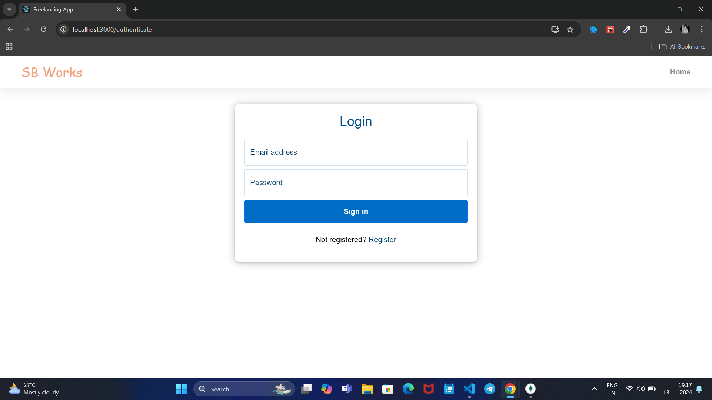
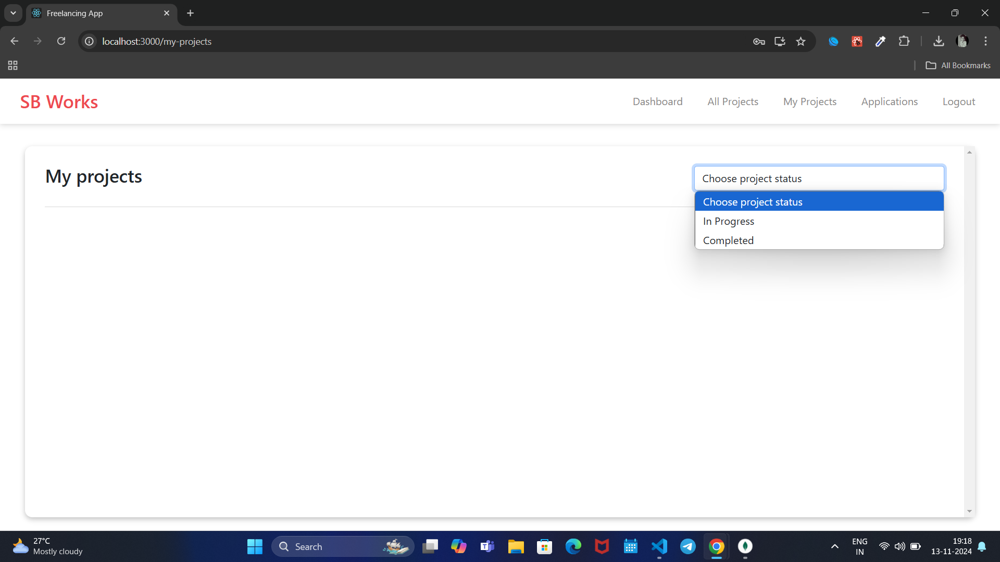

# MERN-Freelancing-Application

Demo App video:(https://drive.google.com/file/d/1DZ-qym5SGbq_ndQeZd8B0N66MeXZcmyy/view?usp=sharing)

A complete freelancing application made using MERN Stack (MongoDB, Express js, React js, Node js)

The Freelancing app is composed of the following Features:

### Front-End

* Framework and Structure: Built with React.js, leveraging a component-based architecture for modular, reusable UI components, ensuring a scalable and maintainable codebase.

* Responsive Design: Developed a mobile-first, responsive interface using CSS3, SCSS, and Bootstrap/Material-UI, making the platform accessible on all devices (mobile, tablet, and desktop).

* State Management: Used Redux or Context API for efficient state management to handle authentication, user data, notifications, and bid/project states consistently across the app.

* User Interface: Created key pages such as the Landing Page, Project Listings, Dashboard, and Profile Page with a modern, professional design focused on ease of navigation and interactivity.

* API Integration: Integrated with backend APIs using Axios for seamless data retrieval and submission, including user authentication, project management, messaging, and payment processing.

* Real-Time Features: Implemented Socket.io for real-time messaging and notifications, allowing clients and freelancers to communicate instantly within the platform.

* Performance Optimization: Used code-splitting, lazy loading, and debouncing on search/filter inputs to reduce load times and enhance the overall user experience.

### Back-End

* Framework and Architecture: Built using Node.js and Express.js, structured with RESTful APIs, adhering to MVC principles for organized and scalable backend development.

* Database Design: Utilized MongoDB with Mongoose for defining collections (Users, Projects, Bids, Messages, Transactions), enabling flexible data modeling for complex relationships like project bids and user roles.

* Authentication and Authorization: Implemented JWT-based authentication for secure login and role-based access control, ensuring only authorized clients and freelancers can access specific functionalities.

* Project and Bid Management: Developed endpoints for managing projects (create, list, update) and bids (submit, accept, reject), allowing clients and freelancers to interact with project listings.

* Real-Time Communication: Used Socket.io to enable real-time messaging between clients and freelancers, improving communication and project coordination.

* Payment Processing: Integrated with Stripe/PayPal APIs to securely handle transactions, with an escrow model that releases funds upon project completion, providing security for both clients and freelancers.

* Middleware and Security: Employed middleware for input validation, logging, and error handling, along with CORS and rate limiting to enhance security and API performance.


This project also demonstrates:

* a typcial React project layout structure

**Screenshots:**
Landing Page:


Signing In Page:


Login Page:



Dashboard Page:


MyProject Page:



Application Page:


All Project Page:


## Developed With

* [Visual Studio Code](https://code.visualstudio.com/) - A source code editor developed by Microsoft for Windows, Linux and macOS. It includes support for debugging, embedded Git control, syntax highlighting, intelligent code completion, snippets, and code refactoring
* [Node.js](https://nodejs.org/en/) - Javascript runtime
* [React](https://reactjs.org/) - A javascript library for building user interfaces
* [Babel](https://babeljs.io/) - A transpiler for javascript
* [Webpack](https://webpack.js.org/) - A module bundler
* [SCSS](http://sass-lang.com/) - A css metalanguage
* [Bootstrap 4](https://getbootstrap.com/) - Bootstrap is an open source toolkit for developing with HTML, CSS, and JS
* [Axios](https://github.com/axios/axios) - Promise based HTTP client for the browser and node.js
* [Express js](http://expressjs.com/) - Express is a minimal and flexible Node.js web application framework that provides a robust set of features for web and mobile applications.
* [MongoDB atlas](https://www.mongodb.com/cloud/atlas) - MongoDB Atlas is the global cloud database service for modern applications.
* [Passport Js](http://www.passportjs.org/) - Passport is authentication middleware for Node.js. Extremely flexible and modular, Passport can be unobtrusively dropped in to any Express-based web application.
---


## Getting Started

These instructions will get you a copy of the project up and running on your local machine for development and testing purposes.

### Prerequisites

The following software is required to be installed on your system:

* Node 8.x
* Npm 3.x

Type the following commands in the terminal to verify your node and npm versions

```bash
node -v
npm -v
```

### Install

Follow the following steps to get development environment running.


* Install node modules #even though they are pre-installed run this command to check if they are up to date

   ```bash
   cd client
   npm install
   cd..
   cd server
   npm install
   ```


### Starting both front end and back end servers

* Build application

  This command will start the mongodb and the front end part.

  ```bash
  cd client
  npm start
  cd..
  cd server
  npm run Start
  ```


